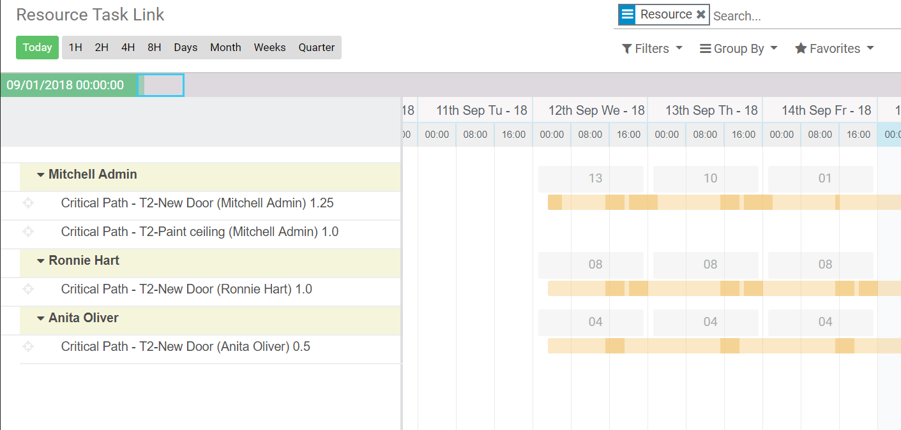

Calc Type - Resources - Resources Task Link

https://www.youtube.com/watch?v=q2MMkvFm1IQ

## Calc Type

##### Work/Duration

Set Calc Type = Work and Plan Value = 72. Gantt calculate Working Time for all resource to Plan Value with Load Factor too.            

Set Calc Type = Duration and Plan Value = 72. Gantt calculate Working Time for all resource to Plan Value with Load Factor too. 

## Resources

##### Add resource to Task

## Resources Task Link

##### Project -> Resource - > Resources Task Link

Group by Resource: you can see, Total Working Hours in Day.            

8H Scale. Vertical Bar show working period in day.            

