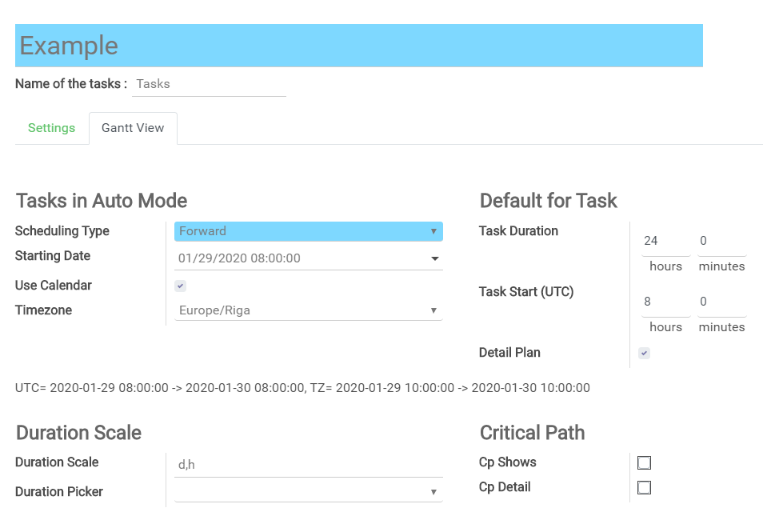
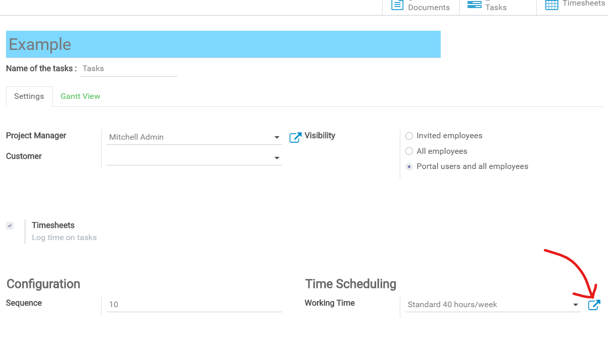
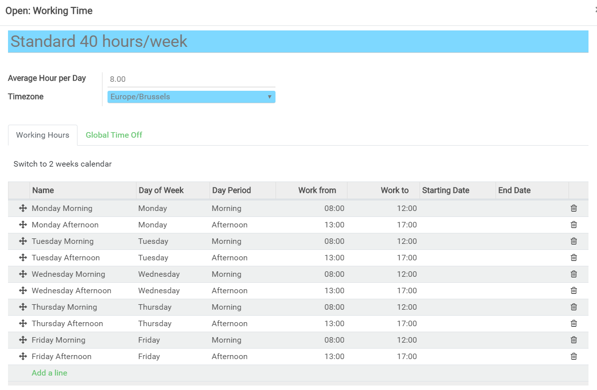
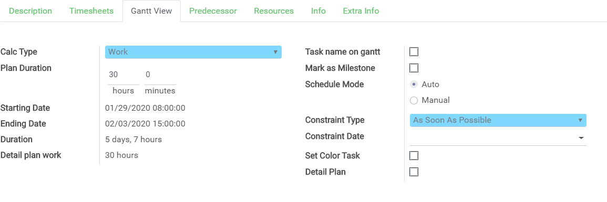
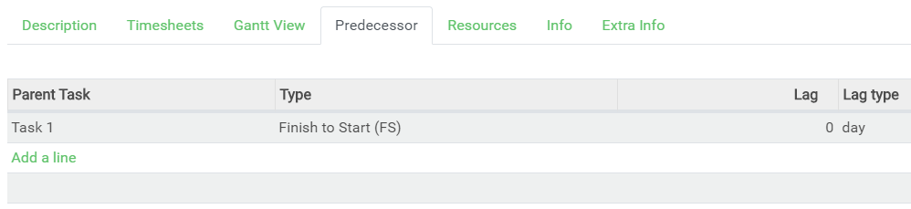
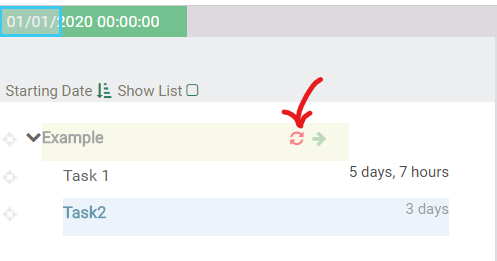
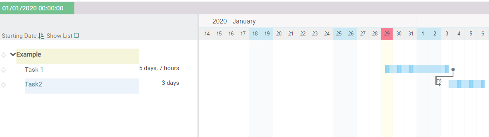
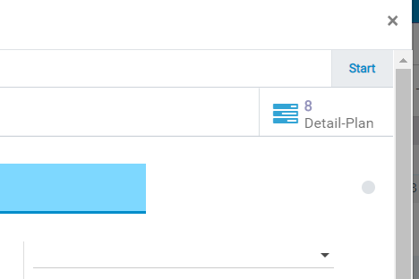
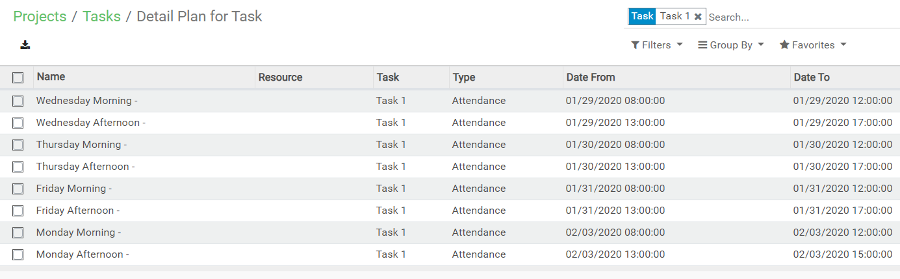
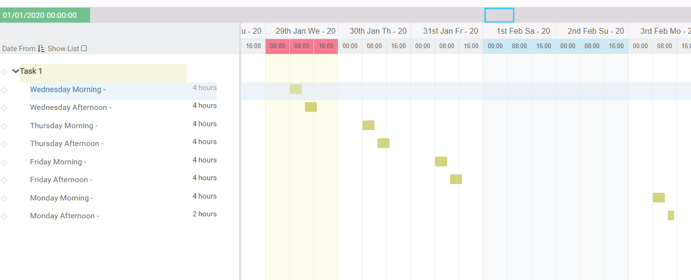

Detail Plan Control in actions


### Step. 1

> ##### Project: Tab - Gantt View

```
Set: 
    "Detail Plan"
    "Starting Date" 
```




### Step. 2

> ##### Open Calendar:



> ##### Use calendar - Working Time:




### Step. 3

> ##### For each Task: 
```
Set: 
    "Schedule Mode" Auto

```



### Step. 4

> ##### For Task2: 
```
Set: 
    "Predecessor" to "Task1"

```




### Step. 5

> ##### Near - project Name : 
```
Set: 
    "Click: Recheduling"

```




> ##### Task Gantt View : 



Look Task Mark Vertical bars: it working time. Weekend it is not working time.

### Step. 6

> ##### Open Task - Shows: 8 Detail-Plan: 



### Step. 7

> ##### Open Detail-Plan for Task2: 

> List View




> Gantt View



